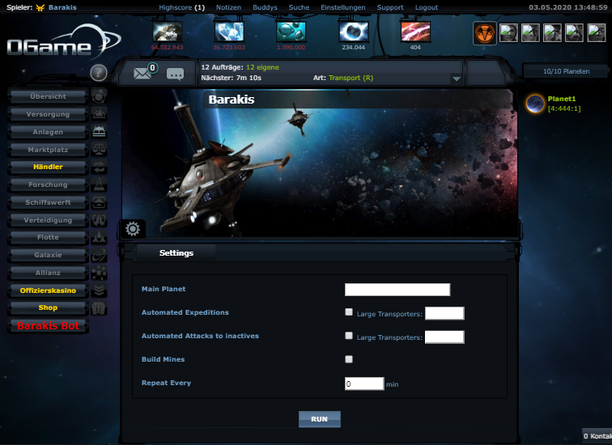

# Barakis
Free to use Ogame Bot using the pyogame lib

### How to Run
Download the repository and unpack it.

install the dependencys in python.


Terminal
```
pip install flask

pip install gevent

pip install ogame
```
And run __init__.py

```
python /Path/__init__.py
```

In settings.py you can input permanent settings like the IP Adress if you proxy is not the same as the client.


##### Windows
If all the Setup is to hard for you you can run the Compiled Barakis_win.exe inside the barakis folder.
Settings wil have no Effekt and the HTML Files need to be in the same PATH


### How it works
<pre>
The bot acts as an Proxy Service for ogame. 
It will sit in the middle of Ogame and your Browser and injects an its Interface in Ogame.
From there you can set settings and press Run the bot will run up and do its Tasks.
Have Fun
</pre>

### Keep in mind
<pre>
The Proxy is not perfect some stuff is not working well. Like the marketplace. 
</pre>